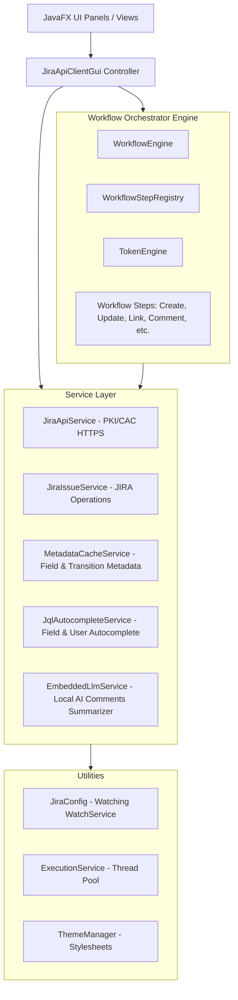

# USMC TSO Jira Client - Technical Reference Manual

This document provides a detailed technical reference of the architecture, service integrations, design models, and build system of the USMC TSO Jira Client desktop application.

---

## 1. System Architecture Overview

The application is built as a modular **JavaFX Desktop Application** using standard Model-View-Controller (MVC) and service-oriented patterns. It targets Java 8 compatibility (compiled using JDK 21+ with `--release 8`) to run securely inside the USMC TSO Windows enterprise desktop environment.

### Architectural Diagram


---

## 2. Core Service Specifications

### A. JiraApiService
*   **Source File**: [JiraApiService.java](file:///C:/Users/braqv/Documents/work%20projects/TSO-Jira-Client/src/tso/usmc/jira/service/JiraApiService.java)
*   **Purpose**: Manages authenticated HTTPS transport using PKI/CAC certificates.
*   **CAC Integration**:
    *   Utilizes the `SunMSCAPI` provider to interface directly with the local Windows Certificate Store (`Windows-MY`).
    *   Provides secure mTLS handshaking by extracting active certificates from CAC hardware card readers dynamically.
*   **Key Operations**:
    *   `executeRequest(String urlStr, String method, String payload)`: Performs raw HTTP/S connections. Automatically intercepts requests to inject proper cert headers and processes responses.
    *   `uploadAttachment(String issueKey, File file)`: Encodes files using multipart/form-data MIME boundaries to execute secure uploads to `/rest/api/2/issue/{key}/attachments`.

### B. JiraIssueService
*   **Source File**: [JiraIssueService.java](file:///C:/Users/braqv/Documents/work%20projects/TSO-Jira-Client/src/tso/usmc/jira/service/JiraIssueService.java)
*   **Purpose**: Abstracts Jira API REST endpoints into structured Java methods.
*   **Key Operations**:
    *   `getTransitions(String issueKey)`: Queries `/rest/api/2/issue/{key}/transitions` to fetch available status transitions.
    *   `transitionIssue(String issueKey, String transitionId, String commentBody)`: Executes status changes.
    *   `addComment(String issueKey, String body)`: Submits new issue comments.

### C. MetadataCacheService
*   **Source File**: [MetadataCacheService.java](file:///C:/Users/braqv/Documents/work%20projects/TSO-Jira-Client/src/tso/usmc/jira/service/MetadataCacheService.java)
*   **Purpose**: Optimizes application startup and offline validation by caching JIRA metadata locally.
*   **Caching Strategy**:
    *   Serializes all Jira project schema fields and custom transitions metadata locally to `metadata_cache.json`.
    *   Supports **Incremental Sync** (syncs only specified active projects) and **Global Deep Sync** (re-queries all fields from Jira).

### D. JqlAutocompleteService
*   **Source File**: [JqlAutocompleteService.java](file:///C:/Users/braqv/Documents/work%20projects/TSO-Jira-Client/src/tso/usmc/jira/service/JqlAutocompleteService.java)
*   **Purpose**: Powers autocompletion for fields, JQL queries, and Jira users.
*   **Caching & API Queries**:
    *   Caches suggestions locally using `ConcurrentHashMap` for up to one hour (`CACHE_DURATION = 1000 * 60 * 60`).
    *   `getUserSuggestions(String userInput)`: Connects to `/rest/api/2/user/search?username={userInput}` to query user names.
    *   `getSuggestions(String fieldName, String userInput)`: Queries JQL field values from `/rest/api/2/jql/autocompletedata/suggestions`.

### E. EmbeddedLlmService
*   **Source File**: [EmbeddedLlmService.java](file:///C:/Users/braqv/Documents/work%20projects/TSO-Jira-Client/src/tso/usmc/jira/service/EmbeddedLlmService.java)
*   **Purpose**: Orchestrates local AI analysis via `llama-cli.exe` and custom GGUF models.
*   **Key Operations**:
    *   `reassembleModel()`: Loops through and reassembles split GGUF chunks (`model.gguf.part00`, `model.gguf.part01`, etc.) into a cohesive model file in the `embedding/` build staging folder.
    *   `generateSummary(String prompt, LlmParameters params)`: Triggers local inference process via a `ProcessBuilder` executing `llama-cli.exe`. Passes context prompts via standard input and pipes outputs back in real-time.

---

## 3. Workflow Orchestrator Engine

The workflow orchestrator compiles and runs complex multi-step automated sequences (Recipes) on batches of Jira issues.

### A. WorkflowEngine
*   **Source File**: [WorkflowEngine.java](file:///C:/Users/braqv/Documents/work%20projects/TSO-Jira-Client/src/tso/usmc/jira/workflow/WorkflowEngine.java)
*   **Concurrency**:
    *   Utilizes **`ThreadLocal`** maps for variables and issue context to maintain strict thread safety during concurrent operations:
        *   `ThreadLocal<Map<String, String>> executionVars`: Isolates variable states (e.g. `{{last_key}}` and runtime prompts) per worker thread.
        *   `ThreadLocal<Map<String, JSONObject>> jsonContexts`: Isolates the active Jira issue JSON payload.
    *   Supports parallel batch execution using `ExecutorService` thread pools configured by the `parallel_threads` system parameter.
    *   Supports `suppressSummaryLogging` mode to prevent duplicate progress bars and logs during parallel operations.

### B. Step Architecture & Registry
All orchestrator steps extend `WorkflowStep` and are dynamically instantiated using `WorkflowStepRegistry`.
*   **[WorkflowStepRegistry.java](file:///C:/Users/braqv/Documents/work%20projects/TSO-Jira-Client/src/tso/usmc/jira/workflow/WorkflowStepRegistry.java)**: Stores step definitions mapping step type tags to their respective classes:
    *   `CREATE` -> `CreateStep.java` (inserts child parent references)
    *   `UPDATE` -> `UpdateStep.java` (updates standard/custom JIRA fields)
    *   `TRANSITION` -> `TransitionStep.java` (advances issue status)
    *   `LINK` -> `LinkStep.java` (binds issues together via custom Link types)
    *   `COMMENT` -> `CommentStep.java` (submits multiline comments)
    *   `WORKLOG` -> `WorklogStep.java` (logs time spent and description logs)
    *   `ATTACHMENT` -> `AttachmentStep.java` (uploads binary attachments)
    *   `ASSET` -> `AssetStep.java` (clones properties, fields, attachments from another issue)
    *   `NOTIFY` -> `NotifyStep.java` (sends email/Jira notifications)

### C. TokenEngine
*   **Source File**: [TokenEngine.java](file:///C:/Users/braqv/Documents/work%20projects/TSO-Jira-Client/src/tso/usmc/jira/workflow/TokenEngine.java)
*   **Purpose**: Resolves double-curly braces tokens `{{token_expr}}` at runtime.
*   **Syntax Rules**:
    *   `{{fields.assignee.name}}`: Resolves to fields nested directly in the Jira issue JSON context.
    *   `{{last.key}}` or `{{last_key}}`: Resolves to the JIRA key of the issue created or linked in the immediately preceding workflow step.
    *   `{{prompt_label.value}}`: Resolves to the runtime input provided by the user in response to a step prompt.

---

## 4. Utilities & App State

### A. JiraConfig (Configuration Manager)
*   **Source File**: [JiraConfig.java](file:///C:/Users/braqv/Documents/work%20projects/TSO-Jira-Client/src/tso/usmc/jira/util/JiraConfig.java)
*   **Auto-Reload Daemon**:
    *   Launches a background daemon thread utilizing Java NIO's `WatchService` to monitor the config directory (`%USERPROFILE%/.JiraApiClient/`).
    *   Automatically re-reads the `JiraConfig.ini` file whenever it is updated by a text editor (like Notepad), triggers live updates on visual themes, active tabs, and autocomplete behaviors.

### B. ExecutionService
*   **Source File**: [ExecutionService.java](file:///C:/Users/braqv/Documents/work%20projects/TSO-Jira-Client/src/tso/usmc/jira/util/ExecutionService.java)
*   **Purpose**: Thread pool wrapper for UI responsiveness. Avoids thread starvation by queuing background tasks on a shared daemon executor.

### C. ThemeManager
*   **Source File**: [ThemeManager.java](file:///C:/Users/braqv/Documents/work%20projects/TSO-Jira-Client/src/tso/usmc/jira/util/ThemeManager.java)
*   **Purpose**: Dynamic CSS style loader. Parses theme definitions (`light-theme`, `dark-theme`, `cyberpunk`, `nord`) and injects stylesheets dynamically into the active JavaFX `Scene`.

---

## 5. UI Layer & Component Specifications

The user interface is built using JavaFX layout panes, customized CSS style rules, and custom-designed input controls to facilitate autocomplete and validation.

### Key Tab Controllers & Panels
*   **[RawApiPanel](file:///C:/Users/braqv/Documents/work%20projects/TSO-Jira-Client/src/tso/usmc/jira/ui/RawApiPanel.java)**: Interfaces with `JiraApiService` to test arbitrary REST endpoints. Loaded templates from `jiratemplate.ini` populate HTTP methods, URLs, and JSON payloads.
*   **[JqlRunnerPanel](file:///C:/Users/braqv/Documents/work%20projects/TSO-Jira-Client/src/tso/usmc/jira/ui/JqlRunnerPanel.java)**: Evaluates complex JQL search queries. Incorporates `JqlAutocompleteTextArea` for dynamic suggestion rendering.
*   **[TaskBuilderPanel](file:///C:/Users/braqv/Documents/work%20projects/TSO-Jira-Client/src/tso/usmc/jira/ui/TaskBuilderPanel.java)**: Implements the offline sub-task generation editor. Hooks keyboard shortcuts, parses override tags, and handles the multi-threaded execution status logger.
*   **[ReconciliationPanel](file:///C:/Users/braqv/Documents/work%20projects/TSO-Jira-Client/src/tso/usmc/jira/ui/ReconciliationPanel.java)**: Reconciles printed mainframe ISPW logs with existing sub-tasks. Uses bounding coordinates from `constants.ini` to extract fields like Action, CI Name, CI Type, SR Number, and User.
*   **[BulkActionPanel](file:///C:/Users/braqv/Documents/work%20projects/TSO-Jira-Client/src/tso/usmc/jira/ui/BulkActionPanel.java)**: Performs bulk transitions, comment posts, and assignee updates across list files.
*   **[CommentSummarizerPanel](file:///C:/Users/braqv/Documents/work%20projects/TSO-Jira-Client/src/tso/usmc/jira/ui/CommentSummarizerPanel.java)**: Connects to `EmbeddedLlmService` to generate off-grid summaries from issue comments.
*   **[WorkflowOrchestratorPanel](file:///C:/Users/braqv/Documents/work%20projects/TSO-Jira-Client/src/tso/usmc/jira/ui/WorkflowOrchestratorPanel.java)**: Implements the drag-and-drop recipe editor and the dynamic execution prompt form generator.

### Custom Controls
*   **[AutocompleteTextField](file:///C:/Users/braqv/Documents/work%20projects/TSO-Jira-Client/src/tso/usmc/jira/ui/AutocompleteTextField.java)**: JavaFX `TextField` wrapper displaying custom `Popup` lists for in-line auto-completions.
*   **[JqlAutocompleteTextArea](file:///C:/Users/braqv/Documents/work%20projects/TSO-Jira-Client/src/tso/usmc/jira/ui/JqlAutocompleteTextArea.java)**: Multiline JQL editor supporting syntax suggestion bindings.

---

## 6. Build and Compilation System

The application compiles without complex external dependency frameworks like Maven or Gradle. It utilizes a batch compilation flow.

### Compilation Batch Script (`compile and build.bat`)
The build staging area performs the following actions sequentially:
1.  **Dependency Handling**: Extracts class files from third-party libraries (specifically `lib/json-20231013.jar`) directly into the `bin/` target output folder using `jar -xf`.
2.  **Java Compilation**: Compiles the source files listed in `sources.txt` targeting Java 8 using the `--release 8` flag and referencing the external jars and JavaFX libraries:
    ```cmd
    javac --release 8 -d bin -cp "lib\json-20231013.jar;lib\jfxrt.jar;bin" @sources.txt
    ```
3.  **Model Reassembly**: If `EMBED_MODEL=YES` is declared, the script calls `copy /b` to merge split GGUF chunks (`lib/model.gguf.part*`) into a cohesive model file at `embedding/models/model.gguf`.
4.  **Packaging**: Archives compiled classes and the entry manifest pointing to `tso.usmc.jira.app.JiraApiClientGui` into `JiraApiClient.jar`.

